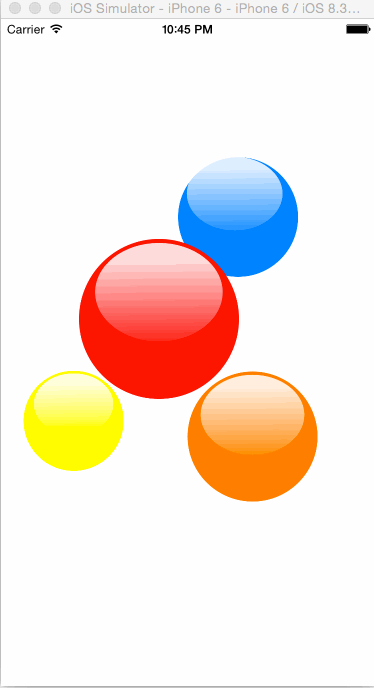

# KYFloatingBubble
类似iOS7中Game Center浮动气泡的效果。

iOS7 Game Center Floating Bubble Effects.

我暂时没有封装，只当是给各位一个实现的思路吧。




##完整代码就这么多：

Here is the whole code:
```swift
        for bt in bubbles{
            
            //1.绕中心圆移动 Circle move
            var pathAnimation = CAKeyframeAnimation(keyPath: "position")
            pathAnimation.calculationMode = kCAAnimationPaced
            pathAnimation.fillMode = kCAFillModeForwards
            pathAnimation.removedOnCompletion = false
            pathAnimation.repeatCount = Float.infinity
            pathAnimation.timingFunction = CAMediaTimingFunction(name: kCAMediaTimingFunctionLinear)
            
            if (bt == self.bubble_yellow) {
                pathAnimation.duration = 5.0
            }else if (bt == self.bubble_orange){
                pathAnimation.duration = 6.0
            }else if (bt == self.bubble_red){
                pathAnimation.duration = 7.0
            }else if (bt == self.bubble_blue){
                pathAnimation.duration = 8.0
            }
        
            var curvedPath = CGPathCreateMutable()
            let circleContainer = CGRectInset(bt.frame, bt.frame.size.width/2-3, bt.frame.size.width/2-3)
            CGPathAddEllipseInRect(curvedPath, nil, circleContainer)
            pathAnimation.path = curvedPath
            bt.layer.addAnimation(pathAnimation, forKey: "myCircleAnimation")
            

            //2.X方向上的缩放 scale in X
            var scaleX = CAKeyframeAnimation(keyPath:"transform.scale.x")
            scaleX.values   =  [1.0, 1.1, 1.0]
            scaleX.keyTimes =  [0.0, 0.5,1.0]
            scaleX.repeatCount = Float.infinity
            scaleX.autoreverses = true
            scaleX.timingFunction = CAMediaTimingFunction(name: kCAMediaTimingFunctionEaseInEaseOut)
            if (bt == self.bubble_yellow) {
                scaleX.duration = 3
            }else if (bt == self.bubble_orange){
                scaleX.duration = 4
            }else if (bt == self.bubble_red){
                scaleX.duration = 6
            }else if (bt == self.bubble_blue){
                scaleX.duration = 5
            }
            bt.layer.addAnimation(scaleX, forKey: "scaleXAnimation")
            
            
            
            //2.Y方向上的缩放 scale in Y
            var scaleY = CAKeyframeAnimation(keyPath:"transform.scale.y")
            scaleY.values = [1.0, 1.1, 1.0]
            scaleY.keyTimes = [0.0, 0.5,1.0]
            scaleY.repeatCount = Float.infinity
            scaleY.autoreverses = true
            scaleX.timingFunction = CAMediaTimingFunction(name: kCAMediaTimingFunctionEaseInEaseOut)
            if (bt == self.bubble_yellow) {
                scaleY.duration = 4
            }else if (bt == self.bubble_orange){
                scaleY.duration = 2
            }else if (bt == self.bubble_red){
                scaleY.duration = 3
            }else if (bt == self.bubble_blue){
                scaleY.duration = 5
            }
            bt.layer.addAnimation(scaleY, forKey: "scaleYAnimation")
        }
        
```
